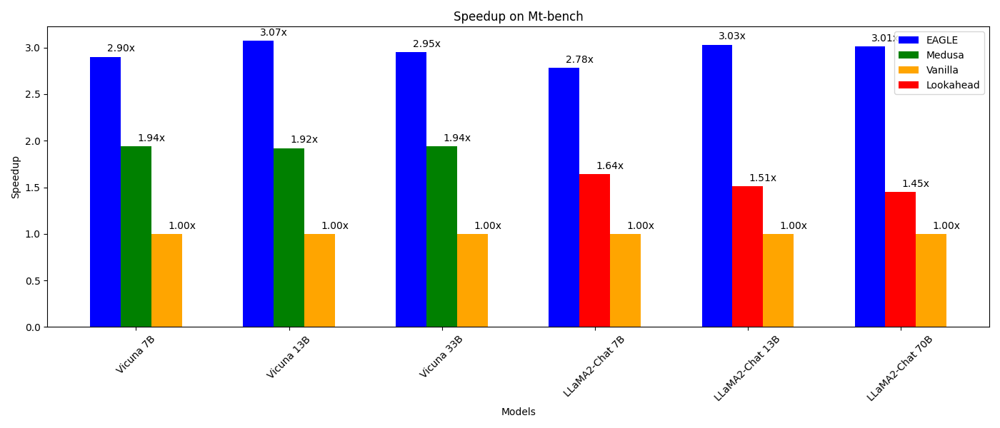

<div align="center"><h1>&nbsp;EAGLE: Lossless Acceleration of LLM Decoding by Feature Extrapolation</h1></div>

<p align="center">
| <a href="https://sites.google.com/view/
eagle-llm"><b>Blog</b></a> |
</p>


<p align="center">
  <a href="">
    
  </a>
  <a href="https://opensource.org/licenses/Apache-2.0">
    
  </a>
  <a href="https://github.com/SafeAILab/EAGLE/issues">
    
  </a>
  <a href="https://github.com/SafeAILab/EAGLE/pulls">
    
  </a>
</p>


##

<p align="center">
  
</p>

EAGLE (Extrapolation Algorithm for Greater Language-model Efficiency) is a new baseline for fast decoding of Large Language Models (LLMs) with provable performance maintenance. This approach involves extrapolating the second-top-layer contextual feature vectors of LLMs, enabling a significant boost in generation efficiency. Theoretically driven (stay tuned for our upcoming paper), EAGLE is building upon the following First Principle:

**The sequence of LLM feature vectors is compressible over time, making the prediction of subsequent feature vectors from previous ones easy.**

- EAGLE is:
	- **3x** faster than vanilla decoding (13B).
 	- **2x** faster than <a href="https://lmsys.org/blog/2023-11-21-lookahead-decoding/"><b>Lookahead</b></a> (13B).
 	- **1.6x** faster than <a href="https://sites.google.com/view/medusa-llm"><b>Medusa</b></a> (13B).
  	- provably maintaining the consistency with vanilla decoding in the distribution of generated texts.
  	- trainable (within 1-2 days) and testable on 8x RTX 3090 GPUs. So even the GPU poor can afford it.
	- combinable with other parallelled techniques such as vLLM, Mamba, FlashAttention, quantization, and hardware optimization.

<p align="center">
  
</p>

_Inference is conducted on RTX 3090 GPUs at fp16 precision using the Vicuna 33B model. For an enhanced viewing experience, the animation has been sped up fourfold._

## Contents

- [Setup & Installation](#setup--installation)
- [EAGLE Weights](#eagle-weights)
- [Inference](#inference)
  - [With UI](#with-ui)
  - [With code](#with-code)
- [Train](#train)
  - [Generate Train Data](#generate-train-data)
  - [Train the Auto-regression Head](#train-the-auto-regression-head)
- [Evaluation](#evaluation)

## Setup & Installation

```bash
pip install -r requirements.txt
```

## EAGLE Weights

| Base Model  | EAGLE on Hugging Face  | \# EAGLE Parameters | Base Model  | EAGLE on Hugging Face  | \# EAGLE Parameters |
|------|------|------|------|------|------|
| Vicuna 7B | [yuhuili/EAGLE-Vicuna-7B-v1.3](https://huggingface.co/yuhuili/EAGLE-Vicuna-7B-v1.3) | 0.24B | LLaMA2-Chat 7B | [yuhuili/EAGLE-llama2-chat-7B](https://huggingface.co/yuhuili/EAGLE-llama2-chat-7B) | 0.24B |
| Vicuna 13B | [yuhuili/EAGLE-Vicuna-13B-v1.3](https://huggingface.co/yuhuili/EAGLE-Vicuna-13B-v1.3) | 0.37B | LLaMA2-Chat 13B | [yuhuili/EAGLE-llama2-chat-13B](https://huggingface.co/yuhuili/EAGLE-llama2-chat-13B) | 0.37B |
| Vicuna 33B | [yuhuili/EAGLE-Vicuna-33B-v1.3](https://huggingface.co/yuhuili/EAGLE-Vicuna-33B-v1.3)| 0.56B | LLaMA2-Chat 70B| [yuhuili/EAGLE-llama2-chat-70B](https://huggingface.co/yuhuili/EAGLE-llama2-chat-70B)| 0.99B |


## Inference
The inference code we provide automatically allocates model weights (loading a model across multiple GPUs), allowing you to run models that exceed the memory of a single GPU.

### With UI
We have provided a suggested web interface, which you can use by running the following command. After the model is fully loaded, a URL will be output in the terminal, which you can enter into your browser to access.
```bash
python -m application.webui --ea-model-path [path of EAGLE weight]\ 
		--base-model-path [path of the original model]\
		--model-type [vicuna or llama-2-chat]
```
### With code
You can use our provided "eagenerate" for speedup generation just like using 'generate' from Hugging Face. Here is an example.
```python
from model.ea_model import EaModel
model = EaModel.from_pretrained(  
    base_model_path=base_model_path,  
    ea_model_path=EAGLE_model_path,  
    torch_dtype=torch.float16,  
    low_cpu_mem_usage=True,  
    device_map="auto"  
)
model.eval()
prompt="Hello"
input_ids=model.tokenizer([prompt]).input_ids
input_ids = torch.as_tensor(input_ids).cuda()
output_ids=model.eagenerate(input_ids,temperature=0.5,max_new_tokens=512)
output=model.tokenizer.decode(output_ids[0])
```

_The current repository only supports a batch size of 1. We plan to update it in the future to support a batch size greater than 1._

## Train

### Generate Train Data
You can run the following command to generate the training data.
```bash
python -m ge_data.allocation --outdir [path of data]
```
### Train the Auto-regression Head
```bash
cd train
accelerate launch --mixed_precision=bf16 main.py --tmpdir [path of data]\
--cpdir [path of checkpoints]
```
## Evaluation
You can test the speed of EAGLE on MT-bench using the following command.
```bash
python -m evaluation.gen_ea_answer_vicuna(or gen_ea_answer_vicuna_llama2chat)\
		 --ea-model-path [path of EAGLE weight]\ 
		 --base-model-path [path of the original model]\
```
If you need specific acceleration ratios, you will also need to run the following command to get the speed of vanilla auto-regression.
```bash
python -m evaluation.gen_baseline_answer_vicuna\
		(or gen_ea_answer_vicuna_llama2chat)\
		 --ea-model-path [path of EAGLE weight]\ 
		 --base-model-path [path of the original model]\
```

## Acknowledgements

This project has been influenced by many excellent projects in the LLM community, such as [Medusa](https://github.com/FasterDecoding/Medusa), [FastChat](https://github.com/lm-sys/FastChat), and others. The logo is designed by GPT-4. We also appreciate many valuable discussions with Tianle Cai, Hao Zhang, and others.
