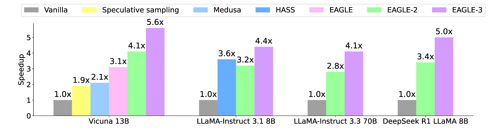

<div align="center"><h1>&nbsp;EAGLE</h1></div>

<p align="center">
| <a href="https://arxiv.org/pdf/2401.15077.pdf"><b>Paper (EAGLE)</b></a> | 
<a href="https://arxiv.org/pdf/2406.16858"><b>Paper (EAGLE-2)</b></a> |
<a href="https://arxiv.org/pdf/2503.01840"><b>Paper (EAGLE-3)</b></a> |
<a href="https://sites.google.com/view/
eagle-llm"><b>Blog</b></a> |
</p>


<p align="center">
  <a href="">
    
  </a>
  <a href="https://opensource.org/licenses/Apache-2.0">
    
  </a>
  <a href="https://github.com/SafeAILab/EAGLE/issues">
    
  </a>
  <a href="https://github.com/SafeAILab/EAGLE/pulls">
    
  </a>
</p>


##

<p align="center">
  
</p>

EAGLE (Extrapolation Algorithm for Greater Language-model Efficiency) is a new baseline for fast decoding of Large Language Models (LLMs) with provable performance maintenance. This approach involves extrapolating the second-top-layer contextual feature vectors of LLMs, enabling a significant boost in generation efficiency. 

- EAGLE is:
	- certified by the <a href="https://github.com/hemingkx/Spec-Bench/blob/main/Leaderboard.md"><b>third-party</b></a> evaluation as the **fastest** speculative method so far. 
	- achieving **2x** speedup on <a href="https://github.com/pytorch-labs/gpt-fast"><b>gpt-fast</b></a>.
	- **3x** faster than vanilla decoding (13B).
 	- **2x** faster than <a href="https://lmsys.org/blog/2023-11-21-lookahead-decoding/"><b>Lookahead</b></a> (13B).
 	- **1.6x** faster than <a href="https://sites.google.com/view/medusa-llm"><b>Medusa</b></a> (13B).
  	- provably maintaining the consistency with vanilla decoding in the distribution of generated texts.
  	- trainable (within 1-2 days) and testable on 8x RTX 3090 GPUs. So even the GPU poor can afford it.
	- combinable with other parallelled techniques such as vLLM, DeepSpeed, Mamba, FlashAttention, quantization, and hardware optimization.

EAGLE-2 uses the confidence scores from the draft model to approximate acceptance rates, dynamically adjusting the draft tree structure, which further enhances performance.

- EAGLE-2 is:
  - **4x** faster than vanilla decoding (13B).
  - **1.4x** faster than EAGLE-1 (13B).

EAGLE-3 removes the feature prediction constraint in EAGLE and simulates this process during training using training-time testing. Considering that top-layer features are limited to next-token prediction, EAGLE-3 replaces them with a fusion of low-, mid-, and high-level semantic features. 
EAGLE-3 further improves generation speed while ensuring lossless performance.

- EAGLE-3 is:
  - **5.6** faster than vanilla decoding (13B).
  - **1.8x** faster than EAGLE-1 (13B).

[//]: # (<p align="center">)

[//]: # (  )

[//]: # (</p>)

[//]: # ()
[//]: # ()
[//]: # (Using EAGLE-2, the inference speed on 2 RTX 3060 GPUs can be faster than vanilla autoregressive decoding on an A100 GPU.)

## Support
EAGLE has been merged in the following mainstream LLM serving frameworks (listed in alphabetical order).

- <a href="https://awsdocs-neuron.readthedocs-hosted.com/en/latest/libraries/nxd-inference/developer_guides/feature-guide.html#eagle-speculative-decoding">AWS NeuronX Distributed Core</a>
- <a href="https://github.com/intel/intel-extension-for-transformers/pull/1504">Intel® Extension for Transformers</a>
- <a href="https://github.com/intel-analytics/ipex-llm/pull/11104">Intel® LLM Library for PyTorch</a>
- <a href="https://llm.mlc.ai/docs/deploy/rest.html">MLC-LLM</a>
- <a href="https://github.com/NVIDIA/TensorRT-LLM/tree/main/examples/eagle">NVIDIA TensorRT-LLM</a>
- <a href="https://github.com/sgl-project/sglang/pull/2150">SGLang</a>
- <a href="https://github.com/vllm-project/vllm/pull/6830">vLLM</a>


## Update
**2025.3.19**: EAGLE-3 is released.

**2024.8.8**: We now support Qwen-2.

**2024.6.27**: EAGLE-2 is released.

**2024.2.25**: EAGLE is certified by the <a href="https://github.com/hemingkx/Spec-Bench/blob/main/Leaderboard.md">third-party</a> evaluation as the fastest speculative method.

**2024.1.17**: We now support [Mixtral-8x7B-Instruct](https://huggingface.co/mistralai/Mixtral-8x7B-Instruct-v0.1).

**2023.12.8**: EAGLE v1.0 is released.


## Todo
- [x] Support non-greedy inference (provably maintaining text distribution).
- [x] Support more LLMs such as Mixtral 8x7B.
- [x] Support LLaMA-3.
- [x] Support Qwen-2.
- [x] Support vLLM (please check <a href="https://github.com/vllm-project/vllm/pull/6830">vLLM</a>'s implementation).
- [x] EAGLE-3.

## The default main branch is the implementation of EAGLE-3 and EAGLE-2. For using EAGLE-1, please switch to the v1 branch.

## Contents

- [Setup & Installation](#setup--installation)
- [EAGLE-3 Weights](#eagle-3-weights)
- [EAGLE Weights](#eagle-weights)
- [Inference](#inference)
  - [With UI](#with-ui)
  - [With Code](#with-code)
- [Train](#train)
  - [Generate Train Data](#generate-train-data)
  - [Train the Auto-regression Head](#train-the-auto-regression-head)
  - [Inference on custom models](#inference-on-custom-models)
- [Evaluation](#evaluation)


## Setup & Installation


```bash
git clone https://github.com/SafeAILab/EAGLE.git
cd EAGLE
pip install -r requirements.txt
```
## EAGLE-3 Weights

| Base Model            | EAGLE-3 on Hugging Face                                                             | Base Model                   | EAGLE-3 on Hugging Face                                                             | 
|-----------------------|-------------------------------------------------------------------------------------|------------------------------|-------------------------------------------------------------------------------------|
| Vicuna-13B-v1.3       | [yuhuili/EAGLE3-Vicuna1.3-13B](https://huggingface.co/yuhuili/EAGLE3-Vicuna1.3-13B) | LLaMA3.1-Instruct 8B         | [yuhuili/EAGLE-LLaMA3.1-Instruct-8B](https://huggingface.co/yuhuili/EAGLE-LLaMA3.1-Instruct-8B) |
| LLaMA3.3-Instruct 70B | [yuhuili/EAGLE3-LLaMA3.3-Instruct-70B](https://huggingface.co/yuhuili/EAGLE3-LLaMA3.3-Instruct-70B) | DeepSeek-R1-Distill-LLaMA 8B | [yuhuili/EAGLE3-DeepSeek-R1-Distill-LLaMA-8B](https://huggingface.co/yuhuili/EAGLE3-DeepSeek-R1-Distill-LLaMA-8B) |


## EAGLE Weights

*Note:* The current code defaults to using EAGLE-3. If you want to use EAGLE weights, please specify `use_eagle3=False` in `EaModel.from_pretrained`.

*Note:* When Qwen2 is the target model, please use bf16 precision instead of fp16 to avoid numerical overflow. The training dataset for the draft model of Qwen2 is ShareGPT, which has removed non-English data. Therefore, if you want to use it on non-English data such as Chinese, please train with the corresponding data.


[//]: # (Compared to EAGLE, EAGLE-2 does not require additional training and uses the same weights.)

| Base Model  | EAGLE on Hugging Face  | \# EAGLE Parameters | Base Model  | EAGLE on Hugging Face  | \# EAGLE Parameters |
|------|------|------|------|------|------|
| Vicuna-7B-v1.3 | [yuhuili/EAGLE-Vicuna-7B-v1.3](https://huggingface.co/yuhuili/EAGLE-Vicuna-7B-v1.3) | 0.24B | LLaMA2-Chat 7B | [yuhuili/EAGLE-llama2-chat-7B](https://huggingface.co/yuhuili/EAGLE-llama2-chat-7B) | 0.24B |
| Vicuna-13B-v1.3 | [yuhuili/EAGLE-Vicuna-13B-v1.3](https://huggingface.co/yuhuili/EAGLE-Vicuna-13B-v1.3) | 0.37B | LLaMA2-Chat 13B | [yuhuili/EAGLE-llama2-chat-13B](https://huggingface.co/yuhuili/EAGLE-llama2-chat-13B) | 0.37B |
| Vicuna-33B-v1.3 | [yuhuili/EAGLE-Vicuna-33B-v1.3](https://huggingface.co/yuhuili/EAGLE-Vicuna-33B-v1.3)| 0.56B | LLaMA2-Chat 70B| [yuhuili/EAGLE-llama2-chat-70B](https://huggingface.co/yuhuili/EAGLE-llama2-chat-70B)| 0.99B |
| Mixtral-8x7B-Instruct-v0.1 | [yuhuili/EAGLE-mixtral-instruct-8x7B](https://huggingface.co/yuhuili/EAGLE-mixtral-instruct-8x7B)| 0.28B |
| LLaMA3-Instruct 8B | [yuhuili/EAGLE-LLaMA3-Instruct-8B](https://huggingface.co/yuhuili/EAGLE-LLaMA3-Instruct-8B)| 0.25B | LLaMA3-Instruct 70B| [yuhuili/EAGLE-LLaMA3-Instruct-70B](https://huggingface.co/yuhuili/EAGLE-LLaMA3-Instruct-70B)| 0.99B |
| Qwen2-7B-Instruct | [yuhuili/EAGLE-Qwen2-7B-Instruct](https://huggingface.co/yuhuili/EAGLE-Qwen2-7B-Instruct)| 0.26B | Qwen2-72B-Instruct| [yuhuili/EAGLE-Qwen2-72B-Instruct](https://huggingface.co/yuhuili/EAGLE-Qwen2-72B-Instruct)| 1.05B |

## Inference
The inference code we provide automatically allocates model weights (loading a model across multiple GPUs), allowing you to run models that exceed the memory of a single GPU.

### With UI
We have provided a suggested web interface, which you can use by running the following command. After the model is fully loaded, a URL will be output in the terminal, which you can enter into your browser to access.
```bash
python -m eagle.application.webui --ea-model-path [path of EAGLE weight]\ 
		--base-model-path [path of the original model]\
		--model-type [vicuna\llama2\llama3]\
        --total-token [int]
```
The *total-token* is the number of draft tokens. For smaller models and advanced GPUs, this value can be set larger. Adjusting according to the specific device and model can achieve better results. If set to -1, EAGLE-2 will automatically configure this parameter.

### With Code
You can use our provided "eagenerate" for speedup generation just like using 'generate' from Hugging Face. Here is an example.
```python
from eagle.model.ea_model import EaModel
from fastchat.model import get_conversation_template
model = EaModel.from_pretrained(
    base_model_path=base_model_path,
    ea_model_path=EAGLE_model_path,
    torch_dtype=torch.float16,
    low_cpu_mem_usage=True,
    device_map="auto",
    total_token=-1
)
model.eval()
your_message="Hello"
conv = get_conversation_template("vicuna")
conv.append_message(conv.roles[0], your_message)
conv.append_message(conv.roles[1], None)
prompt = conv.get_prompt()
input_ids=model.tokenizer([prompt]).input_ids
input_ids = torch.as_tensor(input_ids).cuda()
output_ids=model.eagenerate(input_ids,temperature=0.5,max_new_tokens=512)
output=model.tokenizer.decode(output_ids[0])
```

**_Note: Vicuna, LLaMA2-Chat, and LLaMA3-Instruct are both chat models. You need to use the correct chat template, otherwise it will cause abnormal output from the model and affect the performance of EAGLE._**


## Train

### Generate Train Data
You can run the following command to generate the training data.
```bash
python -m eagle.ge_data.allocation --outdir [path of data]
```
### Train the Auto-regression Head
```bash
accelerate launch -m --mixed_precision=bf16 eagle.train.main --tmpdir [path of data]\
--cpdir [path of checkpoints] --configpath [path of config file]
```
*eagle/train* provides examples of configuration files.

You can also use DeepSpeed for training.

```bash
cd eagle/train
deepspeed main_deepspeed.py --deepspeed_config ds_config.json
```

### Inference on custom models

If the original LLM structure differs from LLaMA and Mixtral, you can utilize EAGLE as follows:

Copy the modeling_basemodelname.py from the Transformers library and proceed to make modifications to leverage the pre-allocated kv_cache for enhanced speed in the base model. You can refer to model/modeling_llama_kv.py for guidance, where places that require modifications are annotated with # [MODIFIED]. These modifications are minimal.


## Evaluation
You can test the speed of EAGLE on MT-bench using the following command.
```bash
python -m eagle.evaluation.gen_ea_answer_vicuna(or gen_ea_answer_vicuna_llama2chat)\
		 --ea-model-path [path of EAGLE weight]\ 
		 --base-model-path [path of the original model]\
```
If you need specific acceleration ratios, you will also need to run the following command to get the speed of vanilla auto-regression.
```bash
python -m eagle.evaluation.gen_baseline_answer_vicuna\
		(or gen_ea_answer_vicuna_llama2chat)\
		 --ea-model-path [path of EAGLE weight]\ 
		 --base-model-path [path of the original model]\
```
The above two commands will each generate a .jsonl file that records the generation results and wall time. Then, you can use evaluation/speed.py to calculate the ratio of speeds.

## 🌟 Our Contributors

A heartfelt thank you to all our contributors.


## Reference
For technical details and full experimental results, please check [the paper of EAGLE](https://arxiv.org/pdf/2401.15077.pdf), [the paper of EAGLE-2](https://arxiv.org/pdf/2406.16858), and [the paper of EAGLE-3](https://arxiv.org/pdf/2503.01840).
```
@inproceedings{li2024eagle, 
	author = {Yuhui Li and Fangyun Wei and Chao Zhang and Hongyang Zhang}, 
	title = {{EAGLE}: Speculative Sampling Requires Rethinking Feature Uncertainty}, 
	booktitle = {International Conference on Machine Learning},
	year = {2024}
}
@inproceedings{li2024eagle2, 
	author = {Yuhui Li and Fangyun Wei and Chao Zhang and Hongyang Zhang}, 
	title = {{EAGLE-2}: Faster Inference of Language Models with Dynamic Draft Trees}, 
	booktitle = {Empirical Methods in Natural Language Processing},
	year = {2024}
}
@misc{li2025eagle3scalinginferenceacceleration,
      title={EAGLE-3: Scaling up Inference Acceleration of Large Language Models via Training-Time Test}, 
      author={Yuhui Li and Fangyun Wei and Chao Zhang and Hongyang Zhang},
      year={2025},
      eprint={2503.01840},
      archivePrefix={arXiv},
      primaryClass={cs.CL},
      url={https://arxiv.org/abs/2503.01840}, 
}
```

## Acknowledgements

This project has been influenced by many excellent projects in the LLM community, such as [Medusa](https://github.com/FasterDecoding/Medusa), [FastChat](https://github.com/lm-sys/FastChat), and others. The logo is designed by GPT-4. We also appreciate many valuable discussions with Tianle Cai, Hao Zhang, Ziteng Sun, and others.
